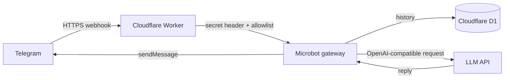

# microbot

[](https://workers.cloudflare.com/) [](https://www.typescriptlang.org/) [](LICENSE)

<p align="center">
  
</p>

`microbot` یک ربات تلگرام مبتنی بر **TypeScript** و **Cloudflare Workers** است که پیام‌های webhook تلگرام را دریافت می‌کند، به یک API سازگار با OpenAI می‌فرستد و پاسخ را بازمی‌گرداند. تاریخچهٔ محدود هر گفت‌وگوی خصوصی در Cloudflare D1 ذخیره می‌شود.

> این پروژه بازنویسی مستقیم nanobot نیست. microbot عمداً قابلیت‌هایی که با مدل serverless Cloudflare ناسازگار یا پرریسک‌اند، مانند shell، فایل‌سیستم محلی، MCP، polling دائمی، WebUI و اجرای ابزارهای محلی را ندارد.

## قابلیت‌های نسخهٔ ۰.۱

| قابلیت | وضعیت |
|---|---|
| Telegram Bot API از طریق webhook | پیاده‌سازی شده |
| Cloudflare Worker با TypeScript | پیاده‌سازی شده |
| مدل سازگار با OpenAI | پیاده‌سازی شده |
| حافظهٔ محدود هر گفت‌وگو در D1 | پیاده‌سازی شده |
| allowlist برای شناسه‌های تلگرام | پیاده‌سازی شده |
| تأیید secret header در webhook | پیاده‌سازی شده |
| فرمان‌های `/start`، `/help` و `/reset` | پیاده‌سازی شده |
| WebUI، shell، MCP، فایل محلی، cron و polling | عمداً خارج از دامنهٔ نسخهٔ اولیه |

## معماری



## انتشار در کمتر از ۱۰ دقیقه

برای انتشار عمومی، این مسیر کوتاه را دنبال کنید. قبل از شروع، یک حساب Cloudflare، یک bot token از BotFather و دسترسی به یک API مدل سازگار با `POST /chat/completions` نیاز دارید.

```bash
npm install
npx wrangler login
npx wrangler d1 create microbot-memory
```

شناسهٔ دیتابیس برگردانده‌شده را در `wrangler.jsonc` جایگزین مقدار نمونه کنید. سپس schema را اعمال و secretها را تعریف کنید:

```bash
npx wrangler d1 migrations apply microbot-memory --remote
npx wrangler secret put TELEGRAM_BOT_TOKEN
npx wrangler secret put TELEGRAM_WEBHOOK_SECRET
npx wrangler secret put LLM_API_KEY
npx wrangler secret put LLM_BASE_URL
npx wrangler secret put LLM_MODEL
npx wrangler secret put ALLOWED_TELEGRAM_USER_IDS
npm run deploy
```

در پایان، URL Worker منتشرشده را در متغیر `MICROBOT_WORKER_URL` قرار دهید و با اجرای `npm run set:webhook` webhook تلگرام را ثبت کنید. اسکریپت فقط از متغیرهای محیطی می‌خواند؛ token یا secret را در هیچ فایل یا command history قرار ندهید.

## پیش‌نیازها

برای توسعهٔ محلی، Node.js و npm لازم است. برای انتشار، یک حساب Cloudflare و یک bot token از BotFather نیاز دارید. همچنین باید به یک API مدل با endpoint سازگار با `POST /chat/completions` دسترسی داشته باشید.

## اجرای محلی

ابتدا وابستگی‌ها را نصب کنید:

```bash
npm install
```

سپس فایل متغیرهای محلی را بدون قرار دادن آن در Git بسازید:

```bash
cp .dev.vars.example .dev.vars
```

در `.dev.vars` مقادیر آزمایشی خود را وارد کنید. برای ایجاد دیتابیس محلی و اعمال migration از این فرمان استفاده کنید:

```bash
npx wrangler d1 migrations apply microbot-memory --local
```

اکنون Worker را اجرا کنید:

```bash
npm run dev
```

سلامت سرویس از این نشانی قابل بررسی است:

```text
http://localhost:8787/health
```

> webhook واقعی تلگرام باید به یک URL عمومی HTTPS ارسال شود؛ بنابراین برای توسعهٔ محلی، update نمونه ارسال کنید یا از یک tunnel قابل‌اعتماد صرفاً برای آزمایش استفاده کنید. از token اصلی production در محیط توسعه استفاده نکنید.

## استقرار روی Cloudflare

### ۱. ایجاد D1

ابتدا login کنید و دیتابیس را بسازید:

```bash
npx wrangler login
npx wrangler d1 create microbot-memory
```

Cloudflare یک `database_id` نمایش می‌دهد. مقدار آن را در `wrangler.jsonc` جایگزین مقدار نمونهٔ `00000000-0000-0000-0000-000000000000` کنید.

### ۲. اعمال schema در محیط production

```bash
npx wrangler d1 migrations apply microbot-memory --remote
```

### ۳. تعریف secretها

این مقادیر را با `wrangler secret put` در Cloudflare ذخیره کنید. هیچ‌یک را در `wrangler.jsonc`، `.dev.vars` یا مخزن Git وارد نکنید.

```bash
npx wrangler secret put TELEGRAM_BOT_TOKEN
npx wrangler secret put TELEGRAM_WEBHOOK_SECRET
npx wrangler secret put LLM_API_KEY
npx wrangler secret put LLM_BASE_URL
npx wrangler secret put LLM_MODEL
npx wrangler secret put ALLOWED_TELEGRAM_USER_IDS
```

مقدار `ALLOWED_TELEGRAM_USER_IDS` باید شامل شناسهٔ عددی تلگرام کاربر یا کاربران مجاز باشد و چند مقدار با ویرگول جدا می‌شوند؛ برای مثال `123456789,987654321`.

### ۴. انتشار

```bash
npm run deploy
```

پس از انتشار، URL Worker را یادداشت کنید؛ مسیر webhook این پروژه `/telegram` است. سپس از Bot API تلگرام، webhook را به نشانی زیر تنظیم کنید:

```text
https://YOUR-WORKER.YOUR-SUBDOMAIN.workers.dev/telegram
```

در فراخوانی `setWebhook`، حتماً همان مقدار `TELEGRAM_WEBHOOK_SECRET` را در پارامتر `secret_token` وارد کنید. Worker درخواست‌هایی را که هدر `X-Telegram-Bot-Api-Secret-Token` آن‌ها با این مقدار یکسان نباشد، رد می‌کند.

## اصول امنیتی

| کنترل | دلیل |
|---|---|
| Workers Secrets | token تلگرام و کلید مدل در مخزن یا فایل پیکربندی باقی نمی‌مانند |
| `TELEGRAM_WEBHOOK_SECRET` | درخواست webhook جعلی را رد می‌کند |
| `ALLOWED_TELEGRAM_USER_IDS` | فقط کاربران مجاز اجازهٔ صحبت با مدل را دارند |
| گفت‌وگوی خصوصی فقط | از فعال‌شدن ناخواسته در گروه‌ها جلوگیری می‌کند |
| بدون shell / MCP / فایل محلی | سطح دسترسی عامل را به حداقل می‌رساند |
| محدودیت حافظه و طول پیام | هزینه و رشد بی‌رویهٔ context را کنترل می‌کند |

## دستورات تلگرام

| دستور | کارکرد |
|---|---|
| `/start` یا `/help` | نمایش پیام راهنما |
| `/reset` | حذف تاریخچهٔ همان chat از D1 |

## انتشار در GitHub

برای انتشار، از نام **`microbot`** و توضیح کوتاه زیر استفاده کنید:

> A secure, serverless Telegram AI bot for Cloudflare Workers.

فایل‌های لازم برای یک مخزن عمومی در این پروژه وجود دارند: `LICENSE`، `SECURITY.md`، `CONTRIBUTING.md`، `CHANGELOG.md`، workflow CI، Dependabot و templateهای Issue/Pull Request. قبل از اولین push، نام repository، URLها و `database_id` نمونه را بازبینی کنید و مطمئن شوید `.dev.vars` یا secret دیگری در Git stage نشده است.

## تفاوت با nanobot

nanobot یک runtime کامل Python با gateway، WebUI، ابزار، حافظهٔ فایل‌محور، MCP و کانال‌های متعدد است. microbot برای محیط serverless ساخته شده و فقط بر **ربات تلگرامِ webhook + API مدل + حافظهٔ D1** تمرکز دارد. نتیجه سبک‌تر، ایمن‌تر و قابل‌استقرار روی Cloudflare است، ولی جایگزین همه‌جانبهٔ nanobot محسوب نمی‌شود.

## منابع فنی

1. [Cloudflare Workers — Secrets](https://developers.cloudflare.com/workers/configuration/secrets/)
2. [Cloudflare D1 — Getting started](https://developers.cloudflare.com/d1/get-started/)
3. [grammY — Hosting on Cloudflare Workers](https://grammy.dev/hosting/cloudflare-workers-nodejs)
4. [Telegram Bot API — setWebhook](https://core.telegram.org/bots/api#setwebhook)
