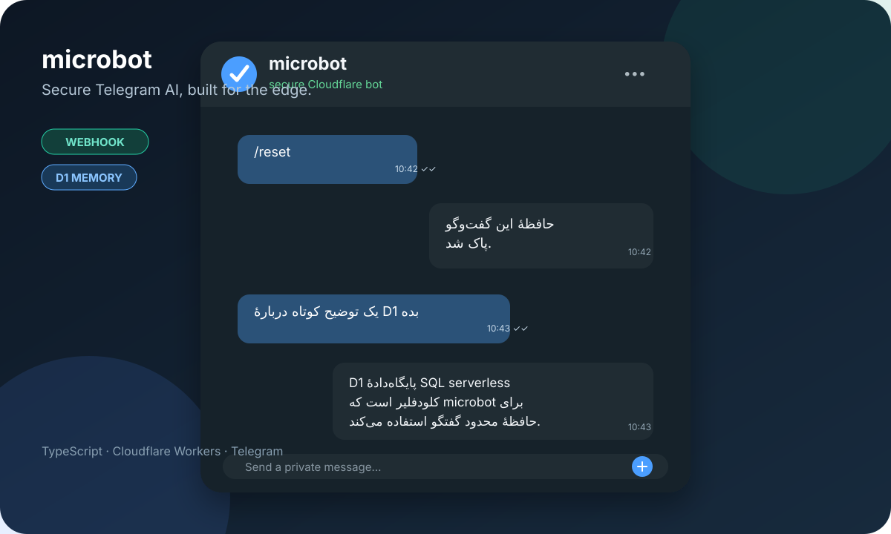
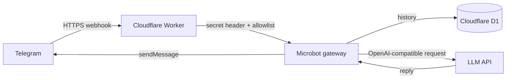

# microbot

[](https://workers.cloudflare.com/) [](https://www.typescriptlang.org/) [](LICENSE)

<p align="center">
  
</p>

<p align="center"><strong>English</strong> · <a href="README.fa.md">فارسی</a></p>

**microbot** is a secure, serverless Telegram AI bot built with **TypeScript** and **Cloudflare Workers**. It receives Telegram webhook updates, sends messages to an OpenAI-compatible model API, and stores a bounded conversation history in Cloudflare D1.

> microbot is not a direct rewrite or a complete replacement for nanobot. It intentionally excludes capabilities that are incompatible with, or unnecessarily risky in, a serverless Worker: shell execution, local filesystems, MCP servers, long polling, a WebUI, and local tool execution.

## Features

| Capability | Status |
|---|---|
| Telegram Bot API via webhook | Included |
| Cloudflare Workers and TypeScript | Included |
| OpenAI-compatible chat-completions API | Included |
| Bounded per-chat conversation memory in D1 | Included |
| Explicit Telegram user allowlist | Included |
| Telegram webhook secret validation | Included |
| `/start`, `/help`, and `/reset` commands | Included |
| WebUI, shell, MCP, local files, cron, and long polling | Deliberately out of scope |

## Architecture



## Deploy in 10 minutes

You need a Cloudflare account, a Telegram bot token from BotFather, and an API endpoint compatible with `POST /chat/completions`.

```bash
npm install
npx wrangler login
npx wrangler d1 create microbot-memory
```

Copy the generated D1 `database_id` into `wrangler.jsonc`, replacing the sample UUID. Apply the database migration and store the required production credentials as Workers Secrets:

```bash
npx wrangler d1 migrations apply microbot-memory --remote
npx wrangler secret put TELEGRAM_BOT_TOKEN
npx wrangler secret put TELEGRAM_WEBHOOK_SECRET
npx wrangler secret put LLM_API_KEY
npx wrangler secret put LLM_BASE_URL
npx wrangler secret put LLM_MODEL
npx wrangler secret put ALLOWED_TELEGRAM_USER_IDS
npm run deploy
```

Set `MICROBOT_WORKER_URL` to the deployed Worker URL, then register the Telegram webhook with `npm run set:webhook`. The helper reads only environment variables. Never commit a bot token, API key, webhook secret, D1 export, or `.dev.vars` file.

## Local development

Install dependencies and create a local secrets file from the safe example:

```bash
npm install
cp .dev.vars.example .dev.vars
npx wrangler d1 migrations apply microbot-memory --local
npm run dev
```

The local health endpoint is available at `http://localhost:8787/health`.

> A real Telegram webhook requires a public HTTPS URL. Use synthetic updates locally, or use a trusted temporary tunnel strictly for development. Do not use a production bot token in local testing.

## Production configuration

The Worker expects the following values. Use Cloudflare Workers Secrets for all production values, even when a value is not inherently sensitive, so deployment configuration stays out of source control.

| Name | Purpose |
|---|---|
| `TELEGRAM_BOT_TOKEN` | BotFather token for the Telegram bot |
| `TELEGRAM_WEBHOOK_SECRET` | Shared secret validated from Telegram's webhook header |
| `LLM_API_KEY` | API key for the model provider |
| `LLM_BASE_URL` | HTTPS base URL of the OpenAI-compatible model API, for example `https://api.openai.com/v1` |
| `LLM_MODEL` | Provider-specific model identifier |
| `ALLOWED_TELEGRAM_USER_IDS` | Comma-separated numeric Telegram user IDs that may use the bot |
| `SYSTEM_PROMPT` | Optional system prompt override |
| `MAX_HISTORY_MESSAGES` | Optional bounded history length; default: `12` |
| `LLM_TIMEOUT_MS` | Optional model-request timeout; default: `25000` |

## Telegram commands

| Command | Result |
|---|---|
| `/start` or `/help` | Shows the usage message |
| `/reset` | Deletes the conversation history for the current chat |

## Security model

microbot only accepts private-chat text messages from configured Telegram user IDs. It rejects webhook requests whose `X-Telegram-Bot-Api-Secret-Token` does not match the configured secret. It does not execute shell commands, access local files, expose a general-purpose tool runtime, or accept wildcard access.

Read [SECURITY.md](SECURITY.md) before a production deployment. If a credential is exposed, rotate it immediately at the issuing provider and update the associated Worker Secret.

## Contributing and project maintenance

This repository includes `CONTRIBUTING.md`, `CHANGELOG.md`, a CI workflow, Dependabot configuration, and issue/PR templates. Read [CONTRIBUTING.md](CONTRIBUTING.md) before opening a pull request.

For a public repository, use this description:

> A secure, serverless Telegram AI bot for Cloudflare Workers.

Recommended GitHub topics are: `cloudflare-workers`, `telegram-bot`, `typescript`, `serverless`, `d1`, and `openai-compatible`.

## Support the project

If microbot is useful to you, consider supporting its development:

[](https://daramet.com/erfan138057)

**USDT (BEP20):** `0x9ee9a9ef2b9679fa99b3b36313bc581a66b05cfb`

## How microbot differs from nanobot

nanobot is a broader Python runtime with a gateway, WebUI, tools, file-backed memory, MCP support, and multiple communication channels. microbot is a narrow Cloudflare-native design focused on **Telegram webhooks, an external model API, and D1-backed conversation memory**. The result is lighter and easier to deploy on Cloudflare, but it is not a general-purpose agent runtime.

## References

1. [Cloudflare Workers Secrets](https://developers.cloudflare.com/workers/configuration/secrets/)
2. [Cloudflare D1: Getting started](https://developers.cloudflare.com/d1/get-started/)
3. [Telegram Bot API: setWebhook](https://core.telegram.org/bots/api#setwebhook)
4. [grammY: Cloudflare Workers hosting guide](https://grammy.dev/hosting/cloudflare-workers-nodejs)
