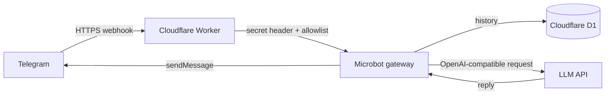

# microbot

[](https://workers.cloudflare.com/) [](https://www.typescriptlang.org/) [](LICENSE)

<p align="center">
  
</p>

<p align="center"><a href="README.md">English</a> · <strong>فارسی</strong></p>

**microbot** یک ربات هوش مصنوعی امن و serverless برای تلگرام است که با **TypeScript** و **Cloudflare Workers** ساخته شده است. پیام‌های webhook تلگرام را دریافت می‌کند، آن‌ها را به یک API مدل سازگار با OpenAI می‌فرستد و تاریخچهٔ محدود هر گفت‌وگو را در Cloudflare D1 نگه می‌دارد.

> microbot بازنویسی مستقیم یا جایگزین کامل nanobot نیست. قابلیت‌هایی مانند اجرای shell، فایل‌سیستم محلی، MCP، polling دائمی، WebUI و ابزارهای محلی عمداً خارج از پروژه مانده‌اند؛ زیرا با محیط serverless سازگار نیستند یا سطح ریسک غیرضروری ایجاد می‌کنند.

## قابلیت‌ها

| قابلیت | وضعیت |
|---|---|
| Telegram Bot API از طریق webhook | پیاده‌سازی شده |
| Cloudflare Workers و TypeScript | پیاده‌سازی شده |
| API مدل سازگار با OpenAI | پیاده‌سازی شده |
| حافظهٔ محدود هر گفت‌وگو در D1 | پیاده‌سازی شده |
| allowlist برای شناسه‌های تلگرام | پیاده‌سازی شده |
| بررسی secret header در webhook تلگرام | پیاده‌سازی شده |
| فرمان‌های `/start`، `/help` و `/reset` | پیاده‌سازی شده |
| WebUI، shell، MCP، فایل محلی، cron و long polling | عمداً خارج از دامنهٔ پروژه |

## معماری



## انتشار در کمتر از ۱۰ دقیقه

به یک حساب Cloudflare، یک bot token از BotFather و یک endpoint مدل سازگار با `POST /chat/completions` نیاز دارید.

```bash
npm install
npx wrangler login
npx wrangler d1 create microbot-memory
```

Cloudflare یک `database_id` برمی‌گرداند. آن را در `wrangler.jsonc` جایگزین UUID نمونه کنید. سپس migration را اعمال و credentialهای production را در Workers Secrets ذخیره کنید:

```bash
npx wrangler d1 migrations apply microbot-memory --remote
npx wrangler secret put TELEGRAM_BOT_TOKEN
npx wrangler secret put TELEGRAM_WEBHOOK_SECRET
npx wrangler secret put LLM_API_KEY
npx wrangler secret put LLM_BASE_URL
npx wrangler secret put LLM_MODEL
npx wrangler secret put ALLOWED_TELEGRAM_USER_IDS
npm run deploy
```

پس از انتشار، URL Worker را در متغیر `MICROBOT_WORKER_URL` قرار دهید و با اجرای `npm run set:webhook` webhook تلگرام را ثبت کنید. این اسکریپت فقط متغیرهای محیطی را می‌خواند. هرگز bot token، API key، webhook secret، خروجی D1 یا فایل `.dev.vars` را commit نکنید.

## توسعهٔ محلی

وابستگی‌ها را نصب و فایل امن پیکربندی محلی را از نمونه ایجاد کنید:

```bash
npm install
cp .dev.vars.example .dev.vars
npx wrangler d1 migrations apply microbot-memory --local
npm run dev
```

سلامت سرویس محلی در این نشانی قابل بررسی است:

```text
http://localhost:8787/health
```

> webhook واقعی تلگرام به یک URL عمومی HTTPS نیاز دارد. برای توسعهٔ محلی، update ساختگی بفرستید یا فقط در محیط آزمایش از یک tunnel قابل‌اعتماد استفاده کنید. از bot token مربوط به production در توسعهٔ محلی استفاده نکنید.

## پیکربندی production

Worker به متغیرهای زیر نیاز دارد. برای production، همهٔ موارد را در Cloudflare Workers Secrets نگهداری کنید تا هیچ تنظیمی در source control ذخیره نشود.

| نام | کاربرد |
|---|---|
| `TELEGRAM_BOT_TOKEN` | token ربات ساخته‌شده در BotFather |
| `TELEGRAM_WEBHOOK_SECRET` | secret مشترک برای بررسی header درخواست Telegram |
| `LLM_API_KEY` | کلید API ارائه‌دهندهٔ مدل |
| `LLM_BASE_URL` | URL پایهٔ HTTPS برای API سازگار با OpenAI؛ مانند `https://api.openai.com/v1` |
| `LLM_MODEL` | شناسهٔ مدل در ارائه‌دهندهٔ انتخاب‌شده |
| `ALLOWED_TELEGRAM_USER_IDS` | شناسه‌های عددی تلگرام کاربران مجاز، با کاما از هم جداشده |
| `SYSTEM_PROMPT` | تغییر اختیاری system prompt |
| `MAX_HISTORY_MESSAGES` | سقف اختیاری تاریخچه؛ پیش‌فرض: `12` |
| `LLM_TIMEOUT_MS` | زمان‌سنج اختیاری برای درخواست مدل؛ پیش‌فرض: `25000` |

## فرمان‌های تلگرام

| فرمان | نتیجه |
|---|---|
| `/start` یا `/help` | نمایش راهنمای استفاده |
| `/reset` | پاک‌کردن تاریخچهٔ گفت‌وگوی همان chat |

## مدل امنیتی

microbot فقط پیام متنیِ چت خصوصی را از شناسه‌های تلگرامیِ تعریف‌شده قبول می‌کند. درخواست‌های webhook که header آن‌ها با `TELEGRAM_WEBHOOK_SECRET` هم‌خوان نیست رد می‌شوند. این پروژه shell اجرا نمی‌کند، به فایل محلی دسترسی ندارد، یک runtime عمومی برای ابزارها ارائه نمی‌دهد و دسترسی wildcard را نمی‌پذیرد.

پیش از استفاده در production، [SECURITY.md](SECURITY.md) را بخوانید. اگر credentialی افشا شد، آن را فوراً در سرویس صادرکننده rotate کنید و Worker Secret مربوطه را به‌روزرسانی کنید.

## مشارکت و نگهداری پروژه

این repository شامل `CONTRIBUTING.md`، `CHANGELOG.md`، workflow مربوط به CI، تنظیمات Dependabot و templateهای Issue/Pull Request است. پیش از ساخت Pull Request، [CONTRIBUTING.md](CONTRIBUTING.md) را مطالعه کنید.

Description پیشنهادی برای مخزن عمومی:

> A secure, serverless Telegram AI bot for Cloudflare Workers.

Topics پیشنهادی GitHub: `cloudflare-workers`، `telegram-bot`، `typescript`، `serverless`، `d1` و `openai-compatible`.

## تفاوت microbot با nanobot

nanobot یک runtime گسترده‌تر مبتنی بر Python با gateway، WebUI، ابزارها، حافظهٔ فایل‌محور، MCP و کانال‌های ارتباطی متعدد است. microbot یک طراحی Cloudflare-native و محدودتر است که فقط بر **webhook تلگرام، API مدل خارجی و حافظهٔ گفتگو در D1** تمرکز دارد. در نتیجه سبک‌تر و برای استقرار روی Cloudflare مناسب‌تر است، اما runtime عمومی Agent محسوب نمی‌شود.

## منابع

1. [Cloudflare Workers Secrets](https://developers.cloudflare.com/workers/configuration/secrets/)
2. [Cloudflare D1: Getting started](https://developers.cloudflare.com/d1/get-started/)
3. [Telegram Bot API: setWebhook](https://core.telegram.org/bots/api#setwebhook)
4. [grammY: Cloudflare Workers hosting guide](https://grammy.dev/hosting/cloudflare-workers-nodejs)
